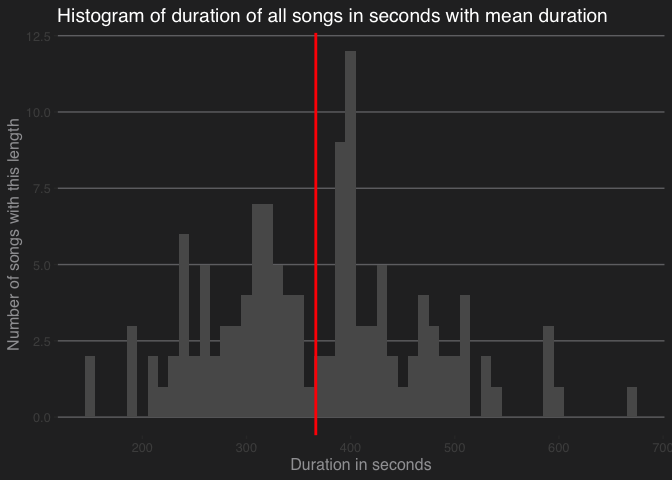
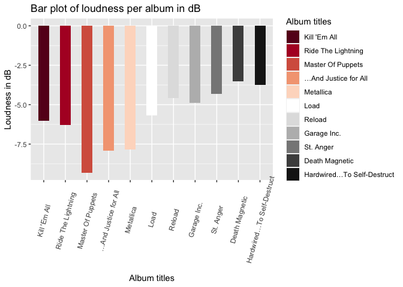
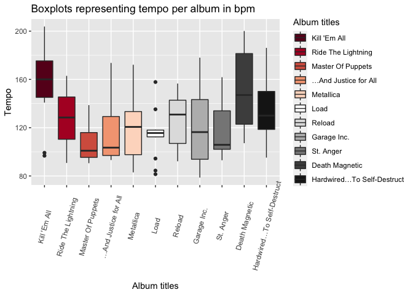
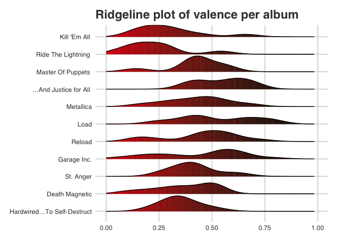
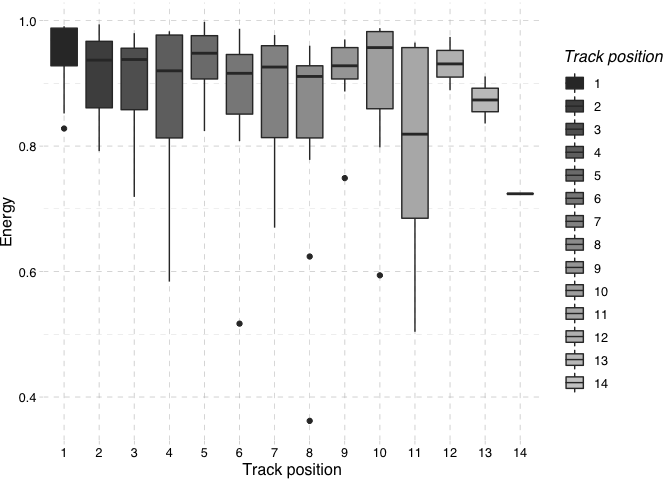
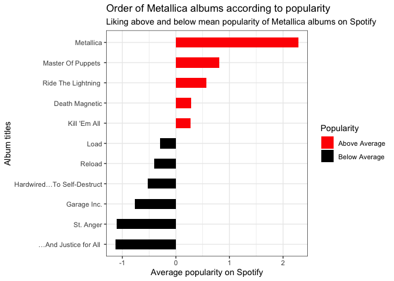

MetallicaR Project
================
Nick Ruth
2/16/2021

## Some insights into Metallica’s music on Spotify

When I started playing bass and guitar, Metallica was a huge influence
for me. I learned to play entire LPs by heart and loved their music ever
since. When Metallica joined Spotify a decade after fighting Napster it
was a great deal, see this [cnet
article](https://www.cnet.com/news/metallica-joins-spotify-buries-the-hatchet-with-sean-parker/).
Almost another decade later, I decided to look into Spotify data and
thought it might be nice to analyze Metallica’s data. Please keep in
mind that this might not reflect the actual listening behavior of true
metalheads and fans from the first hour. Anyway, let’s take a look.

#### Getting the data

I used the free software environment and programming language *R* and
the package *SpotifyR* to get the data from Spotify’s API. You can sign
up for a Spotify developer account for free
[here](https://developer.spotify.com/dashboard/login). You can look at
my code to get the idea of pulling and wrangling the data.

I decided to only use data for the actual LPs, including *Garage Inc.*
but not *S\&M* and *S\&M2* or other live LPs. I am sure not everybody
agrees with my selection. Well, I decided on these albums because they
are good time markers, I dropped S\&M because I didn’t want to include
doubles of songs, and most importantly I really enjoy this sample.

#### Descriptive analyses

First, let’s take a quick look at the data and see if we can find out a
preference of James, Lars, Kirk and the various bass players. Maybe
there is a key that they preferred for their songs?

``` r
metallicaR <- read.csv("./data/metallicaR.csv")

# Metallica's favorite key
metallicaR %>%
  count(key_mode, sort = TRUE) %>%
  head(5) %>%
  kable()
```

| key\_mode |  n |
| :-------- | -: |
| E minor   | 20 |
| C\# major | 14 |
| A major   | 12 |
| C major   | 12 |
| G major   |  9 |

This table shows that **E minor** is the favorite key. Well, no surprise
here from a guitarist point of view. Next, we could take a look at the
songs and their cheerfulness. I am curious to find Metallica’s happiest
songs according to the Spotify metrics.

``` r
#Metallica's most cheerful songs
metallicaR %>%
  arrange(-valence) %>%
  select(name, valence) %>%
  head(5) %>%
  kable()
```

| name                | valence |
| :------------------ | ------: |
| Cure                |   0.792 |
| Die, Die My Darling |   0.791 |
| Hero Of The Day     |   0.780 |
| Bad Seed            |   0.727 |
| Until It Sleeps     |   0.719 |

Ironically, the song titled *Die, Die My Darling* Is in second place.
But to be honest, it is a cheerful song. Let’s check what the saddest
songs are.

``` r
#Metallica's least cheerful songs
metallicaR %>%
  arrange(valence) %>%
  select(name, valence) %>%
  head(5) %>%
  kable()
```

| name                              | valence |
| :-------------------------------- | ------: |
| The More I See                    |  0.0455 |
| Trapped Under Ice - Remastered    |  0.0529 |
| The Unforgiven III                |  0.1030 |
| Phantom Lord - Remastered         |  0.1290 |
| Fight Fire With Fire - Remastered |  0.1330 |

No *Nothing Else Matters*? OK, these are actually not the most positive
songs. So maybe the Spotify metrics are not too bad.

#### Plotting the first insights

In my opinion, statistical results are best displayed using graphs. This
is why I plotted some findings that are interesting (at least I think
they are).

``` r
mean_length_plot <- ggplot(metallicaR,
                           aes(x = duration))

mean_length_plot +
  geom_histogram(binwidth = 10) +
  geom_vline(aes(xintercept = mean(duration)),
             color = "red",
             size = 1) +
  theme_hc(style = "darkunica") +
  xlab("Duration in seconds") +
  ylab("Number of songs with this length") +
  ggtitle("Histogram of duration of all songs in seconds with mean duration")
```

<!-- -->

It looks like most of the songs are about 5 to 6 minutes long. Which
isn’t that surprising for a band like Metallica.  
In my bachelor thesis I examined the so-called **Loudness War**. Many
mastering engineers claimed that *Death Magnetic* is one of the loudest
albums of all times. By loudest they meant that so much compression was
used that the dB (decibel) level was always very high leaving no
headroom and limited dynamic. The following plot shows the mean loudness
and the space between the maximum volume (0 dB).

``` r
metallicaR <- metallicaR %>% arrange(album.release_date)

loudness_album_plot <- ggplot(metallicaR,
                              aes(x = factor(album.name,
                                             levels = unique(album.name)),
                                  y = loudness))

loudness_album_plot +
  geom_bar(stat = "summary",
           aes(fill = factor(album.name,
                             levels = unique(album.name))),
           width = .5,
           fun = "mean") +
  scale_fill_brewer(palette = "RdGy", 
                    name = "Album titles") +
  theme(axis.text.x = element_text(angle = 75, 
                                   vjust = 0.6)) +
  ylab("Loudness in dB") +
  xlab("Album titles") +
  ggtitle("Bar plot of loudness per album in dB")
```

<!-- -->

Indeed, *Death Magnetic* seems to be the loudest LP.  
While comparing albums, we might want to look at tempo, too. Which was
the fastest album? My guess is **KILL EM ALL**.

``` r
tempo_albums_plot <- ggplot(metallicaR,
                          aes(factor(album.name,
                                     levels = unique(album.name)),
                              tempo))

tempo_albums_plot +
  geom_boxplot(aes(fill = factor(album.name,
                                 levels = unique(album.name)))) +
  theme(axis.text.x = element_text(angle = 75, 
                                   vjust = 0.6)) +
  labs("Tempo of LPs",
       "Each box represents the mean tempo of an album with standard deviation") +
  ylab("Tempo") +
  xlab("Album titles") +
  scale_fill_brewer(palette = "RdGy", 
                    name = "Album titles") +
  ggtitle("Boxplots representing tempo per album in bpm")
```

<!-- -->

Correct\! An average of 160 bpm (beats per minute) for *Kill ’Em All*
followed by *Death Magnetic* which seems to feature some of the fastest
songs according to the boxplots.  
We looked at valence before and since we are looking at LPs, let’s
create a smooth graph for the valence of Metallica albums.

``` r
metallicaR <- metallicaR %>% arrange(desc(album.release_date))

valence_albums_plot <- ggplot(metallicaR,
                              aes(x = valence,
                                  y = factor(album.name,
                                             levels = unique(album.name)),
                                  fill = ..x..))
valence_albums_plot +
  geom_density_ridges_gradient(scale = 0.9) +
  scale_fill_gradient(low = "red", high = "black") +
  theme_fivethirtyeight() +
  theme(panel.background = element_rect(fill = "white")) +
  theme(plot.background = element_rect(fill = "white")) +
  xlim(0,1) +
  theme(legend.position = "none") +
  ggtitle("Ridgeline plot of valence per album")
```

    ## Picking joint bandwidth of 0.0632

<!-- -->

The densities lie between 0 (negative valence) and 1 (positive valence)
and indicate that *Ride The Lightning* and *Kill ’Em All* are the most
negative albums, while *Load*, *Garage Inc.*, and **WHAT?\!** *… And
Justice For All* show some positive bumps.  
Let’s get back to the individual songs. I always wondered if there is a
magic number or position on album where the band would put their most
energetic song. We can use boxplots again to examine the track positions
across all LPs.

``` r
tracknumber_energy_plot <- ggplot(metallicaR,
                                  aes(x = factor(track_number),
                                      y = energy),
                                  fill = ..x..)
tracknumber_energy_plot +
  geom_boxplot(aes(fill = factor(track_number))) +
  ylab("Energy") +
  xlab("Track position") +
  theme_pander() +
  scale_fill_grey(name = "Track position")
```

<!-- -->

Looks like the first song is supposed to be the most energetic one.
Well, there is *Battery*, *Fuel*… I agree.

Last but not least, here is the moment we were all waiting for. What is
the most popular Metallica LP?

``` r
# This graph needs some preparations first to get some nice diverging bars
metallicalbum <- metallicaR %>%
  group_by(album.name) %>%
  select(popularity) %>%
  summarize_all("mean")
```

    ## Adding missing grouping variables: `album.name`

``` r
metallicalbum$popularity_z <- round((metallicalbum$popularity -
                                    mean(metallicalbum$popularity))/
                                   sd(metallicalbum$popularity), 2)

metallicalbum$pop_type <- ifelse(metallicalbum$popularity_z < 0, "below", "above")

metallicalbum <- metallicalbum[order(metallicalbum$popularity_z), ]

metallicalbum$album.name <- factor(metallicalbum$album.name,
                                levels = metallicalbum$album.name)

# Now comes the actual plotting

popular_lps_plot <- metallicalbum %>%
  group_by(album.name, popularity_z) %>%
  ggplot(aes(x = album.name,
             y = popularity_z,
             label = popularity_z))

popular_lps_plot +
  geom_bar(stat = "summary",
           fun = "mean",
           aes(fill = pop_type),
           width=.5)  +
  scale_fill_manual(name="Popularity",
                    labels = c("Above Average", "Below Average"),
                    values = c("above"="red", "below"="black")) +
  labs(subtitle = "Liking above and below mean popularity of Metallica albums on Spotify",
       title = "Order of Metallica albums according to popularity") +
  ylab("Average popularity on Spotify") +
  xlab("Album titles") +
  theme_bw() +
  coord_flip()
```

<!-- -->

Like I said, this is based on usage on Spotify. But I think many
Metallica fans would agree that the so-called *Black Album* is a
masterpiece. I hope you enjoyed my analyses and maybe you learned
something new about our favorite band, **MetallicaR**\!

## Disclaimer

Please leave me some comments and ideas on potential questions and
analyses.  
Only songs by Metallica were played while creating this repo.
